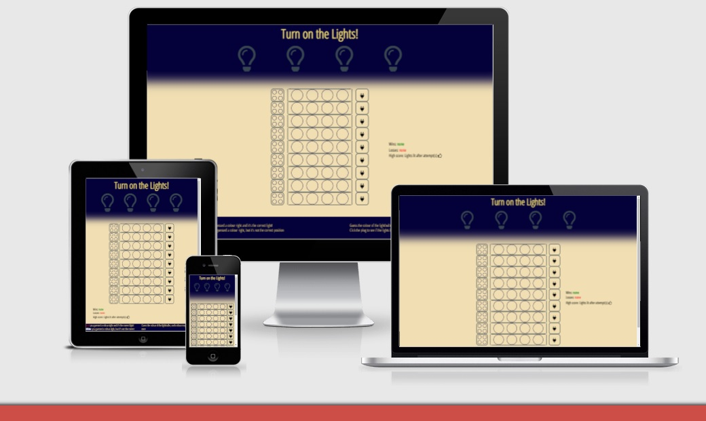
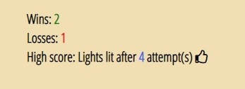

# Light 'm Up!
[Light 'm Up!](https://seamse.github.io/ci-project-two/) is a browser game version of the board game [Mastermind](https://en.wikipedia.org/wiki/Mastermind_(board_game)).  
The player is required to guess a four color code (using six different colors) within a set amount of attempts.  
Rather than simply showing the correct code when the player wins, the lightbulbs at the top turn on in the code's respective colors.  
The game is intended for ages 8 and up.  
 

## UX Design  
### User stories  
* First time visitor goals  
    * For a first time visitor the site's purpose needs to be easily understood. The game needs to be clearly visible and any reading required regarding how to play should be concise and to the point.  

* Returning visitor goals  
    * A returning visitor would simply want to play the game and perhaps aim to beat their high score. Any unnecessary additions such as text regarding the rules of the game should not be visible in a distracting way.  

### Structure  
The game is meant to be clean and simple. The page is therefore only a single page and scrolling will only be required on smaller screen sizes.  
As there is only one page a navigation menu has not been added. To still be able to explain the game to new players without sacrificing simplicity, the basic rules have been described shortly in the footer.  

### Design  
* Colour Scheme  

   

* Typography  
All text throughout the page uses the **Open Sans Condensed** font. The fontstyle is straight and clean, adding a somewhat industrial feel which fits with the theme of lighting up old fashioned lightbulbs.  
 

* Wireframes  
  
 
  
   

* Differences to original design  
In the original design the game had a single submit button, the text in the footer was positioned differently and the score area had a solid border. These were changed in the final design mostly to keep the website's look cleaner and more aesthetically pleasing. Having a button per row, rather than a single button at the bottom of the board, also makes it easier for the user to click continuously rather than having to move down each time to submit their answer.

## Features

### Existing features

* Heading and game title  
The head of the page contains the game name and the four lightbulbs the player is meant to turn on by playing.  
      

* Game board  
The game board area is where the player can insert their own color choices and check if they are correct.  
They can test their code by plugging in the plug (a.k.a. clicking the plug button) to see if the lights turn on.
  

  
* Score area  
The score area keeps count of the player's wins, losses and their high score.  
The player wins by guessing the color code correctly (all four colors must be accurate and in the right position).  
The player loses if the correct code hasn't been guessed within the available attempts on the board.  
The high score is the shortest amount of attempts (board rows) it has taken the player to guess the code correctly.  

  
  
* Footer  
The footer contains a basic explanation of what is required from the player and how to understand the computer's feedback.  

  
  
 

* Game won example  

  
   

* 404 page 

  
   

### Potential future features  

* A possible future feature could be a multiplayer version where two players can play the game together, rather than play against the computer.  
 

## Technologies used  
* HTML5  
* CSS3  
* Javascript  
* [GitHub](https://www.github.com)  
* [Gitpod](https://www.gitpod.io)  
* [Chrome developer tools](https://developer.chrome.com/docs/devtools/)  
* [Balsamiq wireframes](https://balsamiq.com/wireframes/)  
* [Google fonts](https://fonts.google.com/)  
* [Favicon](https://favicon.io/)  
* [Colormind](http://colormind.io/)  

## Testing  

* I tested that the game works in different browsers: Chrome, Microsoft Edge, Safari  
* I confirmed that this project is responsive, looks good and functions on all standard screen sizes using the devtools device toolbar and double-checking on my own iphone SE, ipad, laptop and the office computer.  

### Validator testing   

* HTML  
    * No errors were returned when passing through the official [W3C validator](https://validator.w3.org/)    

* CSS
    * No errors were returned when passing through the official [(Jigsaw) validator](https://jigsaw.w3.org/css-validator/)  

* Javascript
    * No errors were returned when passing through the official [Jshint validator](https://jshint.com/)  
        * The following metrics were returned:  
        There are 39 functions in this file.  
        Function with the largest signature take 3 arguments, while the median is 0.  
        Largest function has 48 statements in it, while the median is 1.  
        The most complex function has a cyclomatic complexity value of 38 while the median is 1.  

* Accessibility
    * I confirmed that the colors and fonts chosen are easy to read and accessible by running it through Lighthouse in devtools.

  
   

## Bugs  
* Solved bugs  
    * The plug button could be clicked before the player had entered a color code to the board. Should the player accidentally click the button before being ready, the game malfunctioned. The bug was solved by adding the buttonclick event listener function inside the function that checks if all four circles have had a color added to them. This ensures the button isn't clickable before all circles have been filled.  
    However, since the buttonclick function requires external parameters and the circle checking is done via a loop, this does cause a warning in the [Jshint validator](https://jshint.com/):  
    *Functions declared within loops referencing an outer scoped variable may lead to confusing semantics.*  
    As I did need to make sure the button isn't activated before all colors have been set and the game works well, I decided to ignore this warning in this scenario.    

    * Although the rules in the footer state that each color may only be used once and the computer only generated a four color code made up of four different colors, the computer didn't care if a player would enter duplicates and happily returned feedback on it. For example: should the player enter the same color four times and this color was present in the computer's generated code, the computer's feedback would be *all four colors are correct but only one is in the correct position*. The bug was solved by adding an if/else statement inside the buttonclick function, making sure that the computer giving feedback isn't activated and a warning is given in the form of an alert when duplicate colors are present.  

    * To make it more obvious that the plug button is ready to be clicked, it is set to change color and appear to light up when a color code has been entered to the board. Unfortunately the button kept lighting up immediately whenever one circle on the board was clicked, rather than after all four had been clicked. This was solved by creating an empty array and pushing each circle's ID into the array when that circle has been clicked, the button now only lights up when all four IDs are present. In order to prevent one ID from being pushed into the array four times the divisions were given a data-disabled attribute through which the ID pushing could be de-activated after they'd been clicked once.  

    * The high score was tricky, it should only change if a player guessed the code quicker than they did the previous tries. This means the new game is compared to the current high score and then the high score either remains the same or changes if the new game was finished quicker. When the game first starts though, the high score doesn't have a value yet, which meant the comparison would always come up as *new game took longer* and the high score wouldn't set. This was fixed by adding an if statement measuring if the current high score is set to null and then setting it to 10 if that is the case.  

    * Keeping the wins, losses and high scores while resetting the game. As the game restarts by refreshing the page, originally the values added to wins / losses / high score would reset as well. This was solved by adding sessionStorage to the scoring.  
   

* Unsolved bugs  
    * Though sound effects were added to the game and they work when testing the site using gitpod, they do not work on the deployed site. Unfortunately I am unsure what causes this issue and have therefore been unable to solve this bug.  

## Deployment  
* The site was deployed to GitHub Pages. The Steps to deploy are as follows:  
    * In the GitHub repository, navigate to the Settings tab.  
    * Scroll down to the GitHub Pages section and click the 'Check it out here!' link.  
    * From the source section drop-down menu, select the Main branch.  
    * Once the Main branch had been selected, the page provided the link to the completed website.  

The live link can be found here: [Light 'm Up!](https://seamse.github.io/ci-project-two/)  
   

## Credits 
### Content   
* Inspiration for the score-area was taken from the CI [Love Maths](https://seamse.github.io/love-maths/) project.  
* The shuffle function was taken from [Stack Overflow](https://stackoverflow.com/questions/2450954/how-to-randomize-shuffle-a-javascript-array)  
* The has duplicates function was taken from [Stack Overflow](https://stackoverflow.com/questions/7376598/in-javascript-how-do-i-check-if-an-array-has-duplicate-values)  
* Other useful pages were:  
    * [Random elements in an array](https://stackoverflow.com/questions/19269545/how-to-get-a-number-of-random-elements-from-an-array)  
    * [Change color with a loop](https://stackoverflow.com/questions/23818675/change-background-color-with-a-loop-onclick)  
    * [Get elements by class name on click](https://stackoverflow.com/questions/13667533/getelementsbyclassname-onclick-issue)  
    * [Click tracking](https://stackoverflow.com/questions/22018136/how-do-i-detect-if-something-is-being-clicked-in-javascript-without-using-jque)  
    * [Check if a list contains a string](https://stackoverflow.com/questions/36782940/how-to-check-if-a-list-contains-a-string-in-javascript)  
    * [Remove event listeners](https://stackoverflow.com/questions/4402287/javascript-remove-event-listener)  
    * [Reload with delay](https://stackoverflow.com/questions/39638903/js-location-reload-with-delay-after-function-executed)  
    * [Session storage](https://www.w3schools.com/jsref/prop_win_sessionstorage.asp)  

### Media  
* The sound effects were taken from [Mixkit](https://mixkit.co/free-sound-effects/game/).  

### Special thanks  
* A special thanks to the slack channel lead Jack Conroy for taking the time to help me think out loud and giving me inspiration when I wasn't certain how to go about things.
* And a special thanks to my mentor Spencer Barriball for grabbing me by the scruff of the neck when I was being too convoluted.  

